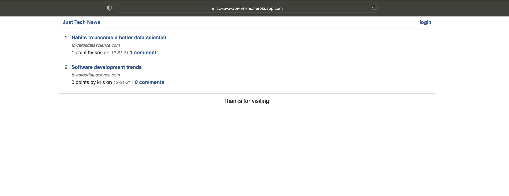
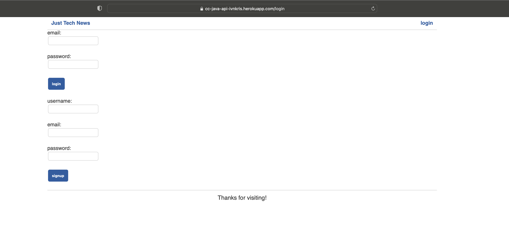
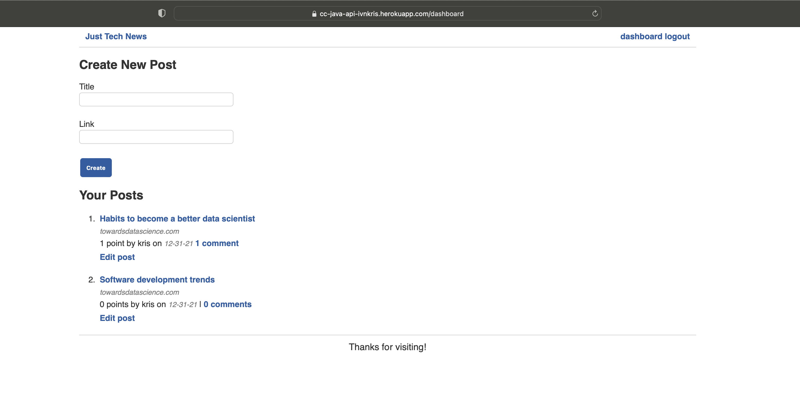
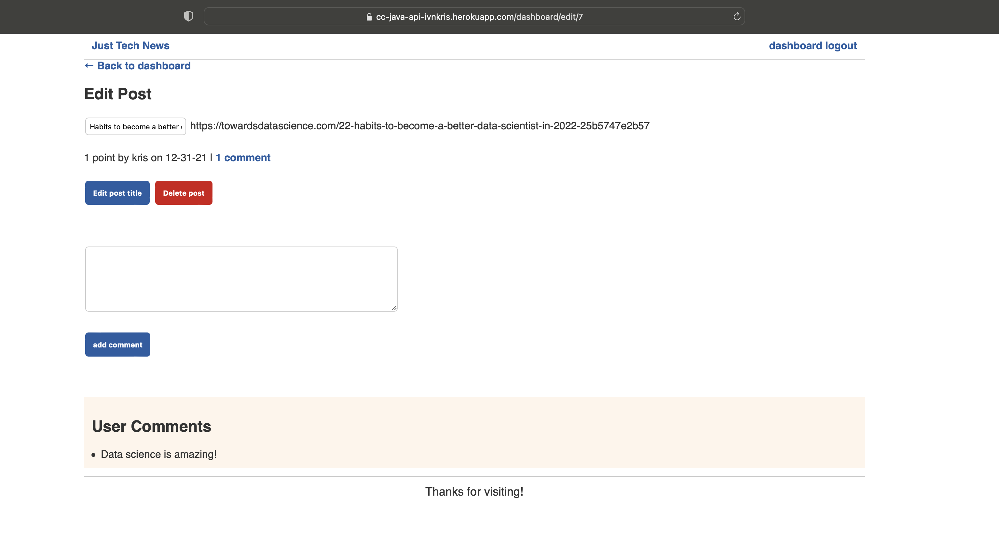
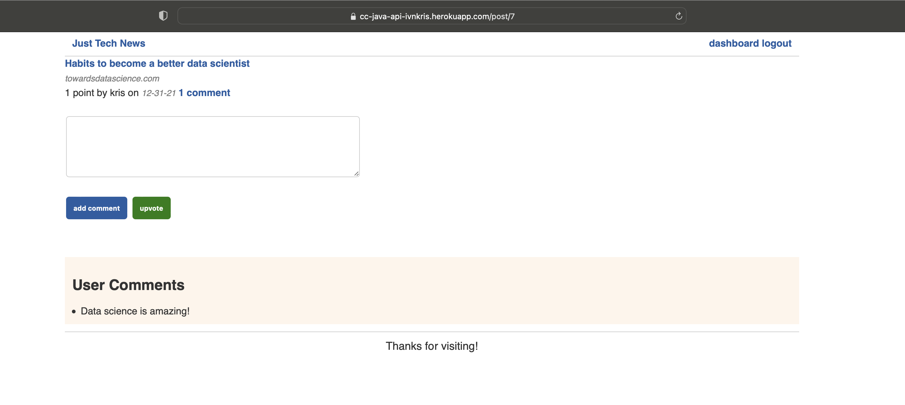

# Tech News Java API

## Description

In this project I have created a full-stack web application for a tech news board using the Spring Java framework with Spring MVC to create RESTful API routes, Spring Session for managing user's session information, Spring Security for authentication and authorization and Thymeleaf Layout Dialect to create layouts and reusable templates.

## What I have done

- [x] Created a Spring Boot Java Project
- [x] Created the Entity Models
- [x] Created the Repository Interfaces and generated Database Tables
- [x] Created REST and Java Controllers
- [x] Made the API user-interactive with Thymeleaf layouts and fragments
- [x] Set up the Front-End Controllers
- [x] Deployed the app to Heroku with ClearDB MySQL

## Contributing

Submit a pull request

## Link to GitHub repository

https://github.com/ivnkris/tech-news-java-api

## Link to deployed application

https://cc-java-api-ivnkris.herokuapp.com

## Screenshots

## Questions

- Send any questions via my [GitHub profile](https://github.com/ivnkris)
